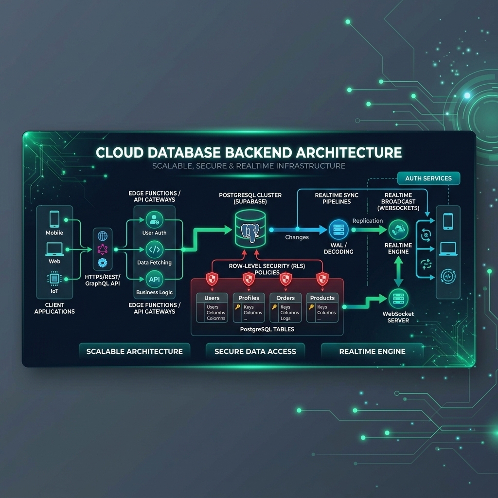

<p align="center">
  
</p>

<h1 align="center">WiseFlow Backend & Supabase Database Architecture</h1>

<p align="center">
  <b>PostgreSQL schema, database migrations, Row-Level Security (RLS) policies, and serverless Edge Functions.</b>
</p>

<p align="center">
  
  
  
  
</p>

---

## 🏛️ System Architecture & Database Capabilities

```
┌─────────────────────────────┬───────────────────────────────┬────────────────────────────┐
│ Relational PostgreSQL Schema│ Row-Level Security (RLS)      │ Deno Edge Functions        │
├─────────────────────────────┼───────────────────────────────┼────────────────────────────┤
│ 🗄️ Multi-wallet tracking    │ 🔒 Strict per-user isolation  │ ⚡ Webhook integrations    │
│ 💳 Linked bank OAuth tokens │ 🛡️ Fine-grained RPC policies   │ 🔑 Plaid / TrueLayer sync  │
└─────────────────────────────┴───────────────────────────────┴────────────────────────────┘
```

- **Migrations Engine**: 120+ sequential SQL migration scripts ensuring bulletproof schema versioning.
- **Row-Level Security**: Zero data leakage across tenant accounts enforced at the database kernel level.
- **Serverless Edge Functions**: Lightweight TypeScript microservices handling webhook callbacks and token exchange.

---

## 🚀 Local Setup

```bash
# Clone repository
git clone https://github.com/WiseFlow-dev/wiseflow-backend-supabase.git

# Start local Supabase emulation
supabase start

# Apply SQL migrations
supabase db reset
```

---

## 📄 License

MIT License © WiseFlow
